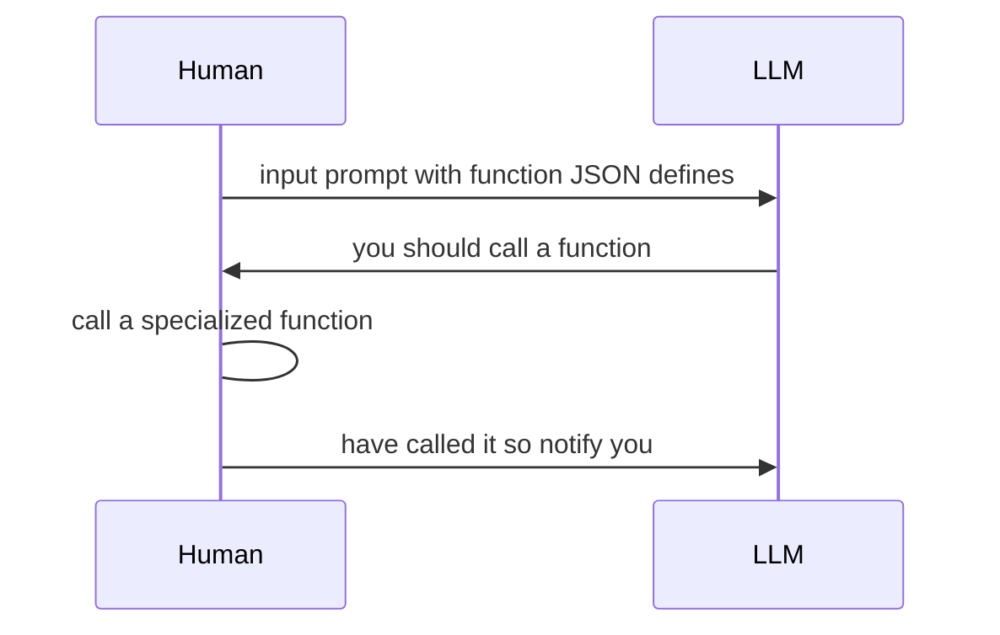

# function calling

最近openai推出了一个新的功能function calling  
主要有三个方面的作用  

- Create chatbots that answer questions by calling external tools
- Convert natural language into API calls（**重点** 我不再是简单的胡说八道的gpt了可以在对话的过程中根据上下文选择和调用api了）
- Extract structured data from text （这个我理解不是很清楚 应该就是从文本里面提取函数的参数过程相当于一个unstructed-->structed的一个变化）

> Function calling in OpenAI is a significant leap in the right direction. It allows the Large Language Model (LLM) to structure output not only into natural conversational language but also into a format that can be consumed by another system, as opposed to a human. This feature structures output for machine consumption in the form of an API, as opposed to human consumption in the form of unstructured natural language.
[link](https://docs.kanaries.net/articles/openai-function-calling)

如上，chatgpt输出自然语言很好的满足了和人的交互，但是如果它需要变得强大需要连接其他的系统如Wolfram和数据库知识库也可能是精通业务处理的函数的数据库。function calling是很重要，因为autogpt子任务靠的就是这个。  
有了这个后可以实现基本的自然语言编程和自动化执行 同时为autogpt提供了更可靠的保证(function call aspect)

画个简单的图说明下

```python
add code tomorrow
```

