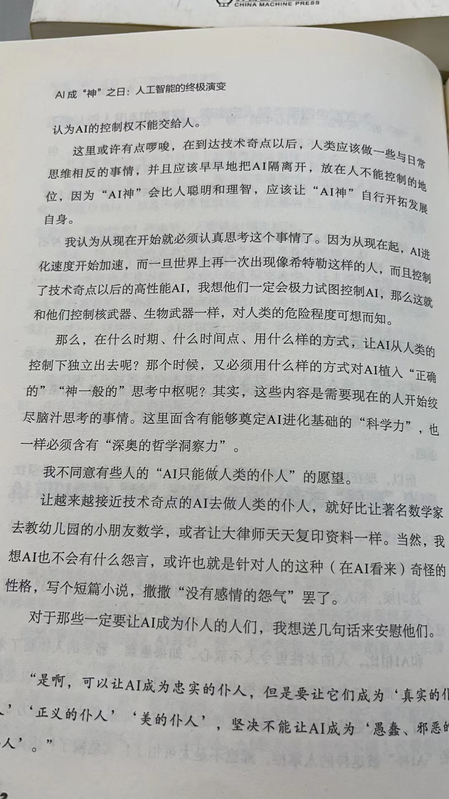

# 读gatesnotes
## The risks of AI are real but manageable

> But thinking about these longer-term risks should not come at the expense of the more immediate ones. I’ll turn to them now.  

主要是谈AI的短期风险  
1. Deepfakes and misinformation generated by AI could undermine elections and democracy 假消息对选举和民主的影响
2. AI makes it easier to launch attacks on people and governments网络安全
3. AI will take away people’s jobs. 经济民生的 AI将会抢普通人的饭碗
4. AI inherits our biases and makes things up. 幻觉胡说八道
5. Students won’t learn to write because AI will do the work for them. 教育方面的 学生将不学习如何写作

gates先生最后说到：
> Finally, I encourage everyone to follow developments in AI as much as possible. It’s the most transformative innovation any of us will see in our lifetimes, and a healthy public debate will depend on everyone being knowledgeable about the technology, its benefits, and its risks. The benefits will be massive, and the best reason to believe that we can manage the risks is that we have done it before.

最后，我鼓励大家尽可能关注人工智能的发展。这是我们每个人有生之年都将看到的最具变革性的创新，而健康的公开辩论将取决于每个人对这项技术、其益处和风险的了解。它的好处将是巨大的，而让我们相信能够控制这些AI风险的最好理由是我们以前已经做到了。

个人读后的感受:  
没有什么问题但是关于工作和教育想说说  

> As I [argued](https://www.gatesnotes.com/The-Age-of-AI-Has-Begun#ALChapter3) in my February post, it’s good for society when productivity goes up. It gives people more time to do other things, at work and at home

在内卷高负债的社会或人口众多的社会里面这个根本就无法实现，AI的大规模使用可能会带来大伤害. 对于普通的工薪阶层，他们需要不停地工作只是因为他们被环境对齐了高负债不好的思想（在没有社会评论家的社会有点可怕）。    
学生还是需要锻炼下写作能力的，毕竟能清楚的用文字表达是一个人的沟通能力。写作是一个专业的技能。  
还有一点AI最好不要用于军事，否则不是你涂炭就是我涂炭。 AI军事无人机杀你分分钟的事。所以有空可以学习ai的对抗，添加噪声什么的让AI识别不了你。  
如果隐私问题不处理好（不要天天要求我视频认证日了狗） 只有你的照片在相关的系统里面杀人AI可能大概率会kill you.

reference:  
[the risks of AI](https://www.gatesnotes.com/The-risks-of-AI-are-real-but-manageable)
